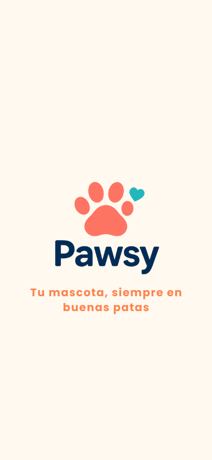
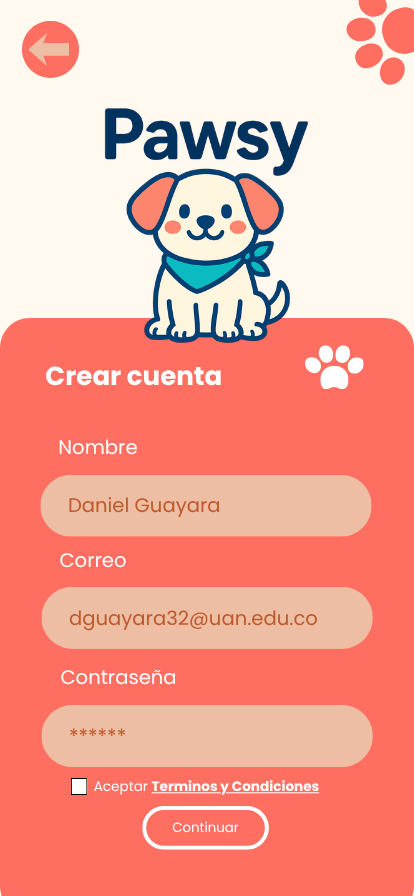
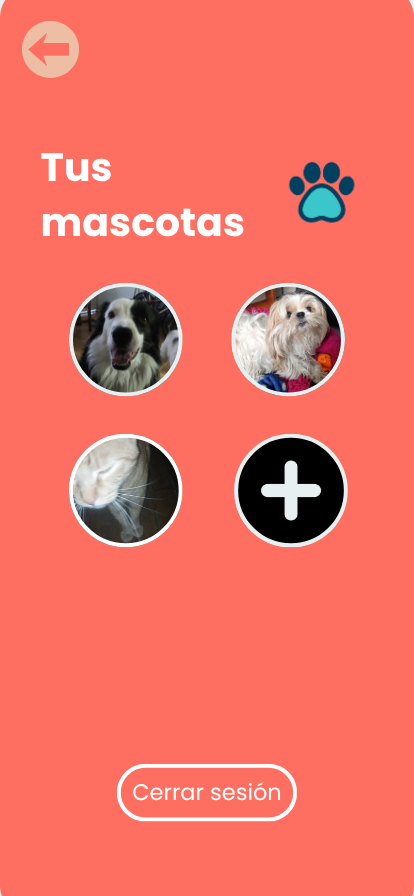
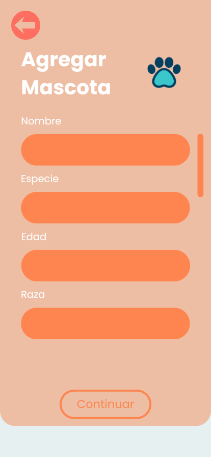
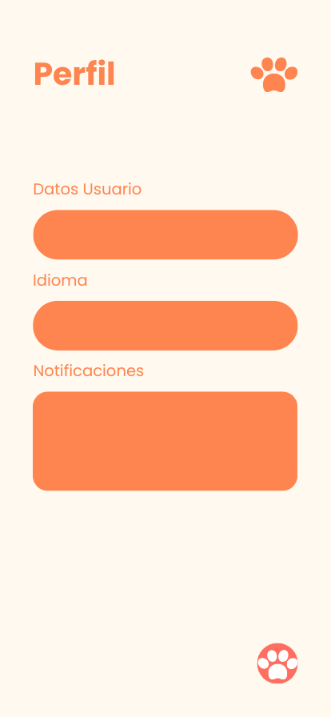
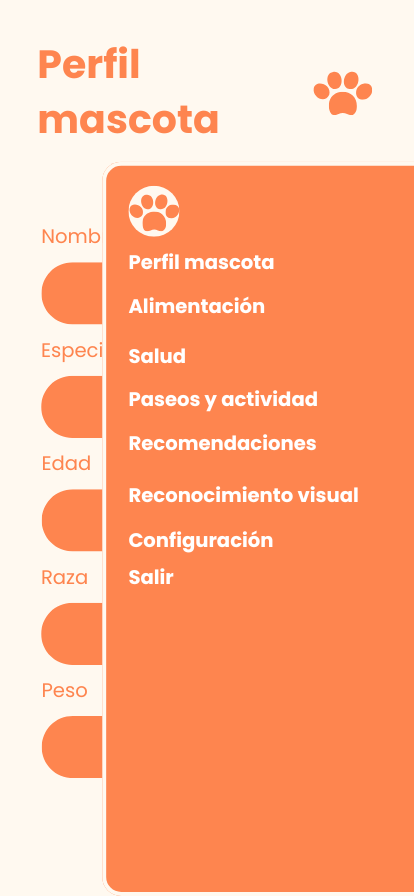
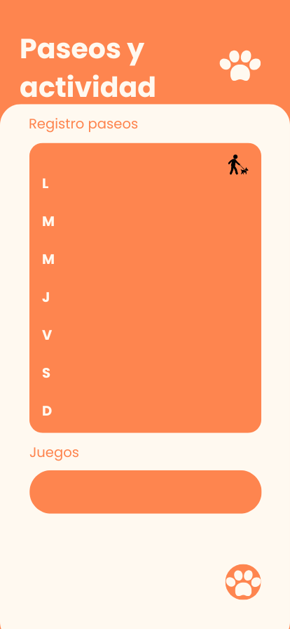
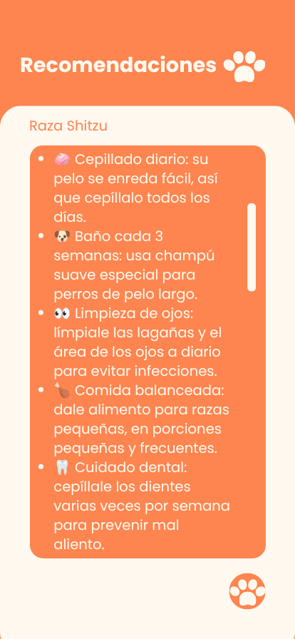
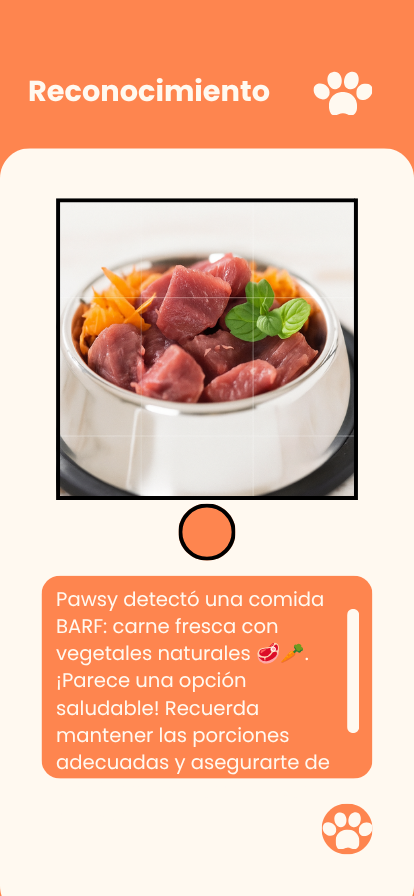

# Diseño de interfaz de usuario

La aplicación tendrá la siguientes pantallas

1. Pantalla 1: Slogan Inicio App

2. Pantalla 2: Inicio de Sesión 

3. Pantalla 3: Crear Cuenta

4. Pantalla 4: Perfil Mascotas 

5. Pantalla 5: Agregar Mascotas

6. Pantalla 6: Perfil Usuario

7. Pantalla 7: Lista Desplegable

8. Pantalla 8: Lista Actividades

9. Pantalla 9: Lista Recomendaciones

10. Pantalla 10: Reconocimiento Imagen

# Referencias

- [Pawsy App](https://canva.link/d9j88ddh1logyex)

